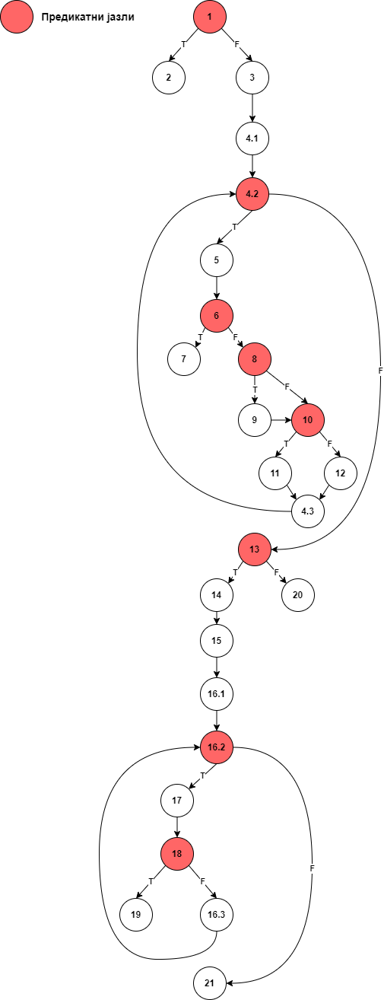
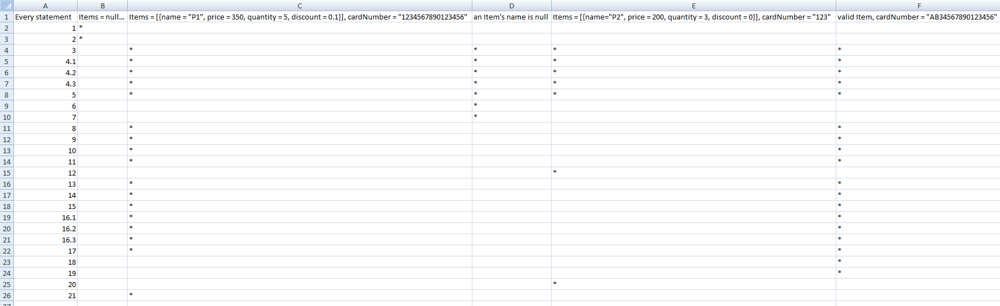
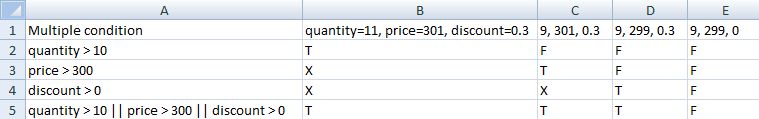

# SI_2025_lab2_181553
Живко Шишовски 181553

###2.
Прикачена е сликата "CFG_SI_lab2.png"

###3.
Цикломатската комплексност на овој код е 9. Неа ја добив преку формулата P+1, каде што P е бројот на предикатни јазли. Во овој случај, P=8, па цикломатската комплексност е 9.

###4.
Every Statement критериумот бара секоја наредба во методот да биде извршена барем еднаш.

Минималниот број на тест случаи потребен за да се постигне овој критериум е 5.

###5.
За да го задоволиме Multiple Condition критериумот за линијата код
"if (item.getPrice() > 300 || item.getDiscount() > 0 || item.getQuantity() > 10)"
ќе треба да бидат земени предвид сите комбинации на резултати од условите:

item.getPrice() > 300
item.getDiscount() > 0
item.getQuantity() > 10

За P(A) = F е земена вредност 9,   а за P(A) = T -> 11
За P(B) = F е земена вредност 299, а за P(B) = T -> 301
За P(C) = F е земена вредност 0,   а за P(C) = T -> 0.3

Минималниот број на тест случаи потребен за да се постигне овој критериум е 8.